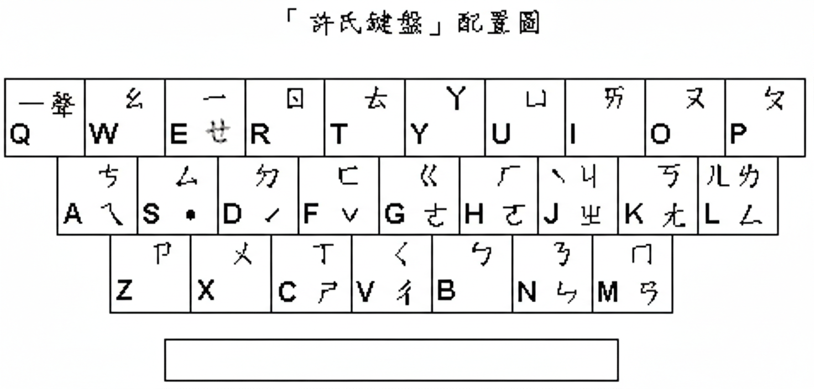

# RIME 注音・許式輸入方案

> 基於 Patrick (`ipatrickmac@gmail.com`) 的許式注音 Rime 方案修改而來。
> 原始方案已無法找到 Patrick 的 GitHub，僅存電子郵件資訊。

## 簡介

- 注音符號輸入，採用「許式」鍵盤排列
- 以 `q` `d` `f` `j` `s` 輸入聲調「ˉˊˇˋ˙」
- Space / Enter 直接送出候選字
- 支援繁簡轉換、全形半形切換、中英文切換

## 與原版差異

| 項目 | 原版 | 修改後 |
|---|---|---|
| 編輯器 | `fluency_editor`（Space 僅確認不送出） | `express_editor`（Space 直接送出） |
| 候選字讀音提示 | 拼音 | 注音符號 |
| 空韻處理 | 未處理（ㄕ顯示為ㄕㄧ） | 正確消除空韻 |
| 快捷鍵 | Emacs 風格 | Vim 風格（Ctrl+hjkl） |

## 檔案列表

| 檔案 | 說明 |
|---|---|
| `bopomofo_hsu.schema.yaml` | 許式注音方案 |
| `bopomofo_Hsu.png` | 許式鍵盤配列圖 |

## 鍵盤配列

## 聲調鍵

| 按鍵 | 聲調 |
|---|---|
| `q` | ˉ（一聲） |
| `d` | ˊ（二聲） |
| `f` | ˇ（三聲） |
| `j` | ˋ（四聲） |
| `s` | ˙（輕聲） |

## 組字快捷鍵

| 按鍵 | 功能 |
|---|---|
| Ctrl+j / Ctrl+k | 下 / 上一個候選 |
| Ctrl+h / Ctrl+l | 游標左 / 右移 |
| Ctrl+u / Ctrl+d | 上 / 下翻頁 |
| Ctrl+[ | 取消組字 |
| Tab / Shift+Tab | 下 / 上翻頁 |

## 安裝方式

將 `bopomofo_hsu.schema.yaml` 複製至 Rime 用戶資料夾：

- Linux（fcitx5）：`~/.local/share/fcitx5/rime/`
- Linux（IBus）：`~/.config/ibus/rime/`
- macOS：`~/Library/Rime/`
- Windows：`%APPDATA%\Rime`

執行**重新部署**後，於選單（F4）內選取即可使用。
